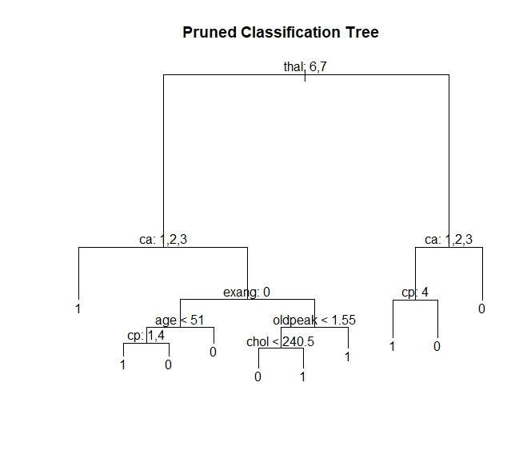

# Heart Disease Classification Analysis

## **Objective:**
The objective of this project is to use R to assess the performance of 3 different classification methods and to train a model that can be used to classify the presence or absence of heart disease. After spliting the data into training and testing data, the following classification models were trained and tested:
* Logistic regression model with ridge regression regularization
* K-nearest neighbours model
* Classification tree model

## **Tools:**
1.	R - glmnet, pROC, class, epiR, tree 

## **Data Source:**
Heart Disease Dataset: https://archive.ics.uci.edu/ml/datasets/Heart+Disease

## **Screenshot:**

Final Pruned Classifcation Tree

